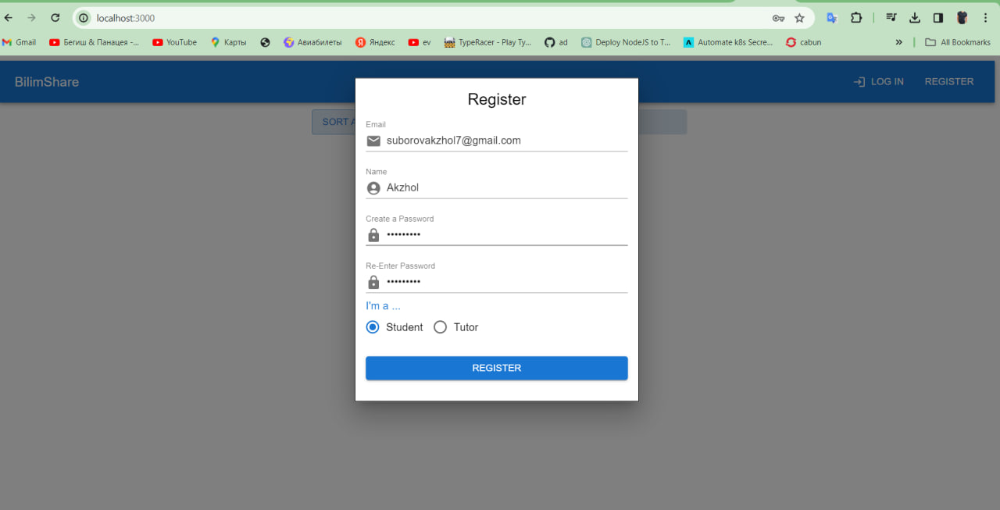
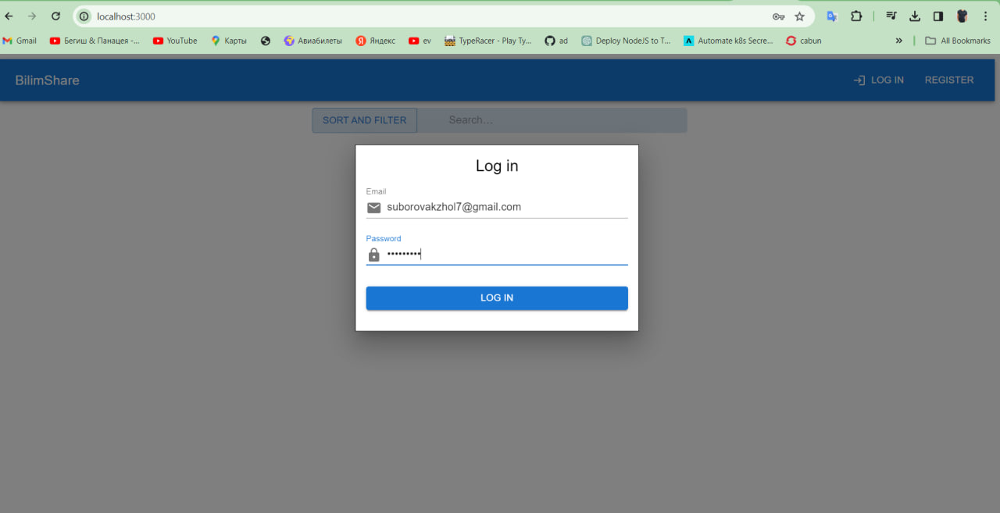
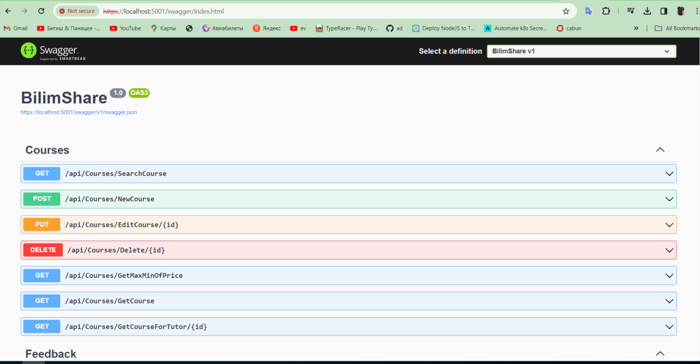
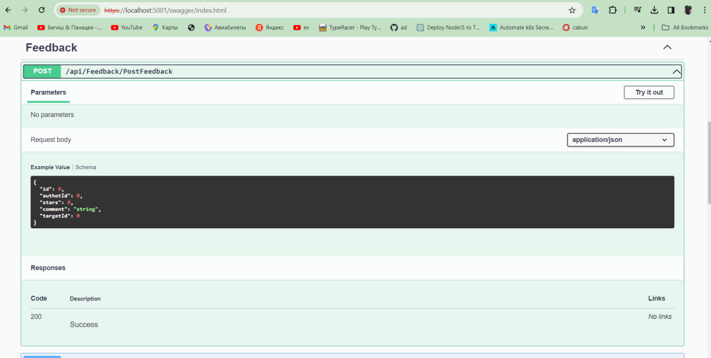
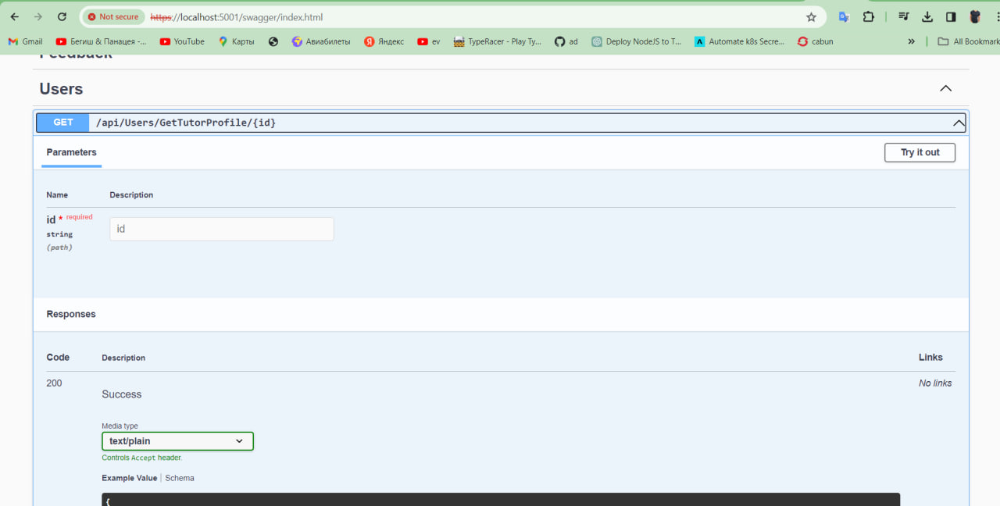
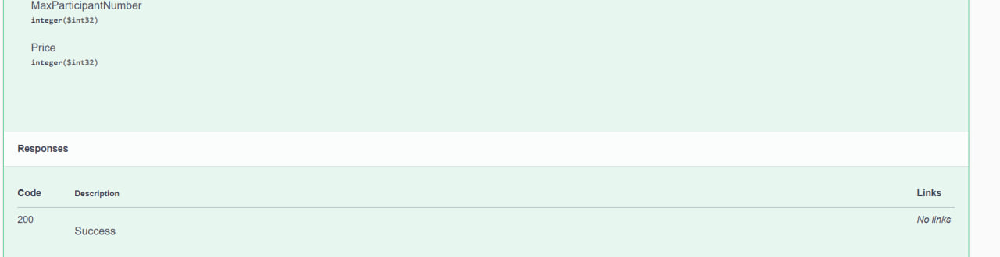
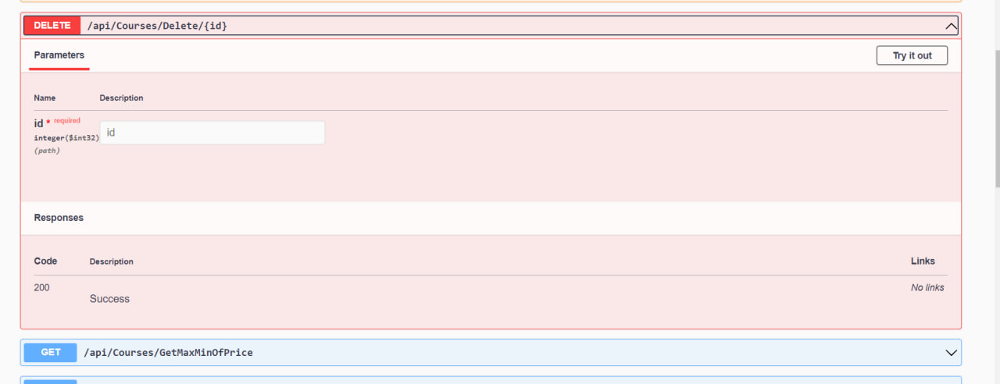
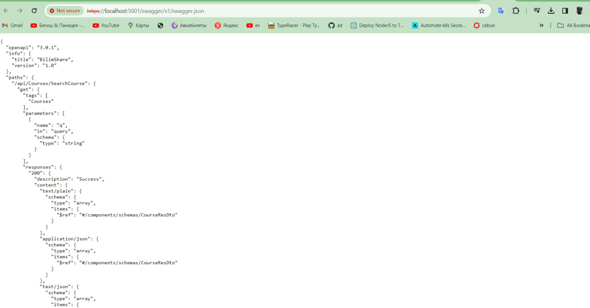

# bilimshare
Web application development
BilimShare
Front-end: React+Material UI
Back-end: ASP.NET Web API

## About my app
My app will mainly help to the students to manage their study stuffs like adding updating their courses and so on... 7

## Screenshots

